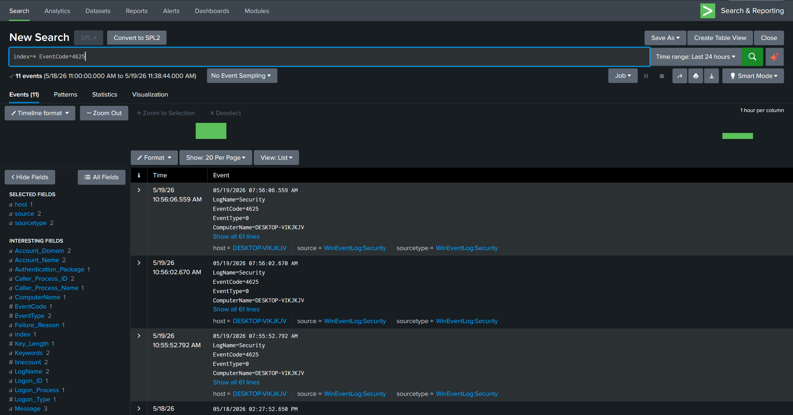

**Objectives**

Simulate repeated failed login attempts and validate SIEM detection capabilities.
Will be analysed using splunk after generating alerts. 

**Attack Simulation**

A Windows endpoint was accessed on Windows 10, and multiple incorrect password attempts were performed to generate failed authentication events. (EventCode 4625)

Once the logs were generated they were forwarded to Splunk for analysis. The first step would be to index the logs around the time the logs were generated, for this exercise the 24 hour was enough. In a real environment this would be too broad of a time frame and would need to be narrowed for a focused view of the incident. The query Index=* was used to porpogate the logs as well as EventCode=4625

