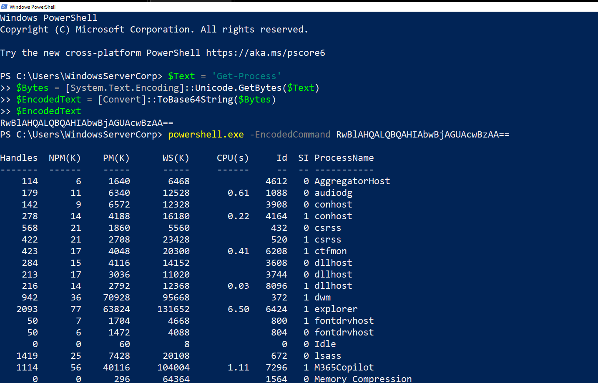

## Objective

The objective of this exercise was to simulate the execution of powershell commands and verify if the commands are potentially malicious.

---

## Attack Simulation 

A powershell command will be encoded and executed on a windows 10 victim end point which would generate the logs for further analysis in splunk

---

## SIEM Analysis

The following query was used to retrieve relevant events:

---
index=* "powershell" EventCode=4688  NOT "Files\\SplunkUniversalForwarder\\bin\\splunk"
---

