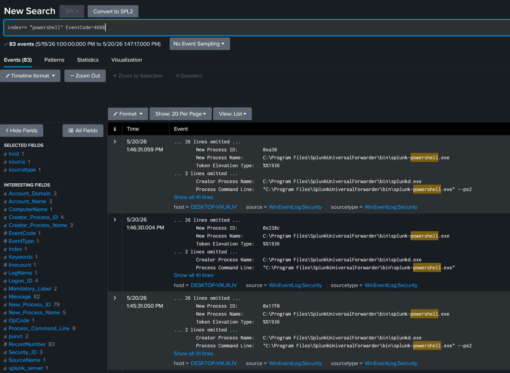
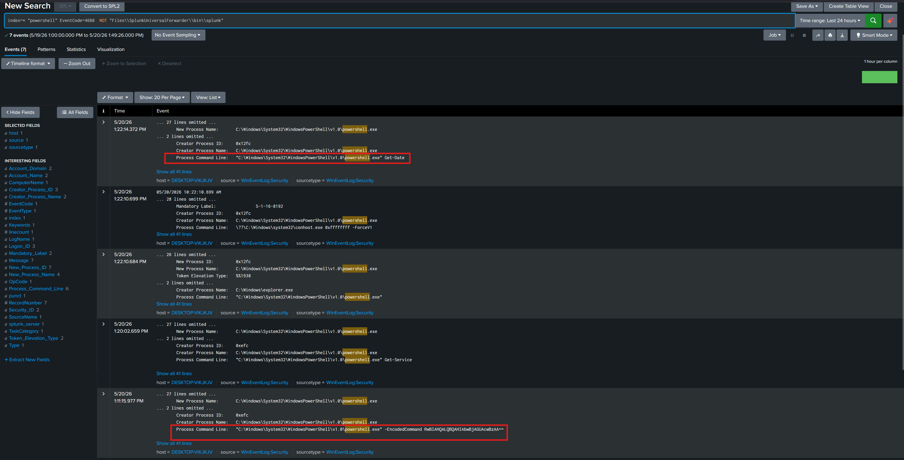

## Objective

The objective of this exercise was to simulate the execution of powershell commands and verify if the commands are potentially malicious.

---

## Attack Simulation 

A powershell command will be encoded and executed on a windows 10 victim end point which would generate the logs for further analysis in splunk

---

## SIEM Analysis

The following queries were used to retrieve relevant events and exclude artefacts which were not relevant

index=* "powershell" EventCode=4688 were used for the initial query

Upon running the queries it was realised that there were too many redundant splunk artifacts and an additional query was required which was "NOT "Files\\SplunkUniversalForwarder\\bin\\splunk" for further refinement

---

